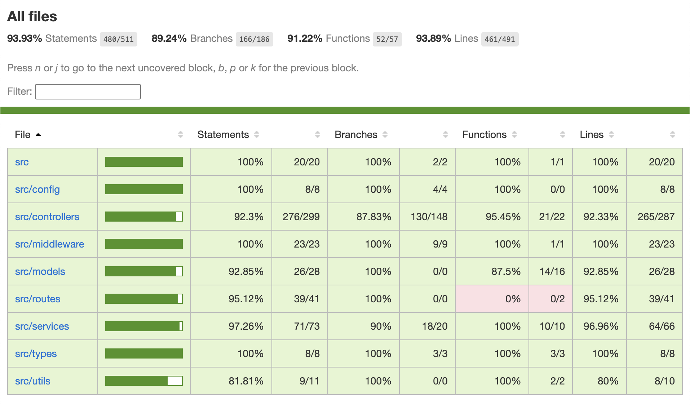

# Team Ditto - AI-Powered Content Generation API

An intelligent API service that generates and validates marketing content using AI. Built with TypeScript, Express, Supabase, and Google Cloud Vertex AI.

## Table of Contents
- [Getting Started](#getting-started)
- [API Documentation](#api-documentation)
- [Style Checker](#style-checker)
- [Tools & Testing](#tools--testing)
- [Bugs & Challenges Encountered Documentation](#bugs--challenges-encountered-documentation)
- [AI Citations](#ai-citations)

---

## Getting Started

### Prerequisites

Before you begin, ensure you have the following installed and configured:

- **Node.js** (v16 or higher)
- **npm** (comes with Node.js)
- **Supabase Account** - For database and authentication
- **Google Cloud Platform Account** - With Vertex AI API enabled

### Environment Setup

1. **Clone the repository:**
   ```bash
   git clone https://github.com/ldang04/team-ditto.git
   cd team-ditto
   ```

2. **Install dependencies:**
   ```bash
   npm install
   ```

3. **Create environment file:**
   
   Create a `.env` file in the project root with the following variables:
   ```env
   # Supabase Configuration
   SUPABASE_URL=your-supabase-project-url
   SUPABASE_SERVICE_KEY=your-supabase-service-role-key
   
   # Google Cloud Platform Configuration
   GCP_PROJECT_ID=your-gcp-project-id
   VERTEX_MODEL_TEXT=gemini-2.5-flash-lite
   
   # Server Configuration (optional)
   PORT=3000
   ```

4. **Set up Google Cloud credentials:**
   
   Place your GCP service account JSON file in the project root as `gcp-service-account.json` (this file is gitignored for security).
   
   Alternatively, authenticate using:
   ```bash
   gcloud auth application-default login
   ```

5. **Set up Supabase database:**
   
   Your Supabase database should have the following tables:
   - `clients` - Client organizations
   - `api_keys` - API keys for authentication
   - `projects` - Marketing projects
   - `themes` - Brand themes
   - `contents` - Generated content
   - `embeddings` - Vector embeddings for content validation
   
   See the Supabase schema in your project dashboard or contact your team for the schema file.

### Build

Compile TypeScript to JavaScript:

```bash
npm run build
```

This creates compiled JavaScript files in the `dist/` directory.

### Run the Application

#### Development Mode (with auto-reload):
```bash
npm start
```

This runs the server using `ts-node-dev` which automatically reloads on file changes.

#### Production Mode:
```bash
npm run build
npm run start:prod
```

The server will start on `http://localhost:3000` (or the PORT specified in your `.env` file).

#### Verify the server is running:
```bash
curl http://localhost:3000/api/vertex-test
```

### Run Tests

#### Unit Tests:
```bash
# Run all unit tests
npm test

# Run with coverage report
npm run test:unit

# Run with JUnit XML output (for CI/CD)
npm run test:unit:junit
```

#### API Tests:
**Note:** The server must be running for API tests to work.

In one terminal:
```bash
npm start
```

In another terminal:
```bash
npm run api:test
```

**Logging Verification:** API tests trigger logging in the server. To verify logging works:
1. Watch the first terminal (where `npm start` is running) during API tests
2. You should see `console.log` output for errors and debugging
3. Each endpoint call generates log entries showing the service is functioning

#### Generate All Reports:
```bash
npm run reports:all
```

This generates:
- Unit test results
- Coverage reports
- API test results
- Coverage summary

### Project Structure

```
team-ditto/
├── src/                      # Source code
│   ├── controllers/          # Request handlers
│   ├── models/              # Database models
│   ├── routes/              # API routes
│   ├── services/            # Business logic (e.g., EmbeddingService)
│   ├── middleware/          # Authentication middleware
│   ├── config/              # Configuration (Supabase client)
│   ├── types/               # TypeScript type definitions
│   ├── utils/               # Utility functions
│   ├── app.ts               # Express app configuration
│   └── index.ts             # Server entry point
├── tests/                    # Test files
├── postman/                  # Postman collection and environment
├── reports/                  # Generated test reports
├── dist/                     # Compiled JavaScript (gitignored)
├── coverage/                 # Coverage reports (gitignored)
├── __mocks__/                # Jest mocks for testing
├── package.json              # Dependencies and scripts
├── tsconfig.json            # TypeScript configuration
├── jest.config.ts           # Jest configuration
├── eslint.config.js         # ESLint configuration
└── README.md                # This file
```

---

## API Documentation

### Authentication

**Most endpoints require API key authentication.** Include your API key in the `Authorization` header:

```
Authorization: Bearer YOUR_API_KEY
```

**How to get an API key:**
1. First, call `/api/clients/create` (no auth required) to create a client
2. You'll receive an API key in the response - **save it immediately!**
3. Use that API key in the `Authorization` header for all other endpoints

### Endpoints Overview

#### Public Endpoints (No Authentication Required)

| Method | Endpoint | Description |
|--------|----------|-------------|
| POST | `/api/clients/create` | **Start here!** Create a new client and get an API key |
| GET | `/api/vertex-test` | Test Vertex AI connection |

#### Protected Endpoints (Require Authentication)

| Method | Endpoint | Description |
|--------|----------|-------------|
| **Projects** |||
| POST | `/api/projects/create` | Create a new project |
| GET | `/api/projects` | List all projects for authenticated client |
| PUT | `/api/projects/:id` | Update a project |
| **Themes** |||
| POST | `/api/themes/create` | Create a new brand theme |
| GET | `/api/themes` | List all themes for authenticated client |
| **Contents** |||
| GET | `/api/contents/:project_id` | List all content for a project |
| **Generation & Validation** |||
| POST | `/api/generate` | Generate marketing content with AI |
| POST | `/api/validate` | Validate content against brand guidelines |

### Detailed API Documentation

For comprehensive API documentation including request/response formats, examples, and error codes, see:
- **[VALIDATE_API.md](./VALIDATE_API.md)** - Detailed documentation for the `/api/validate` endpoint
- **[EMBEDDINGS_README.md](./EMBEDDINGS_README.md)** - Explanation of the embedding system used for validation

### Example API Calls

#### 1. Create a Client
```bash
curl -X POST http://localhost:3000/api/clients/create \
  -H "Content-Type: application/json" \
  -d '{"name": "My Company"}'
```

Response:
```json
{
  "success": true,
  "data": {
    "client_id": "abc-123",
    "api_key": "your-api-key-here"
  },
  "message": "Client created successfully"
}
```

**IMPORTANT:** Save the API key - it's only shown once!

#### 2. Create a Project
```bash
curl -X POST http://localhost:3000/api/projects/create \
  -H "Content-Type: application/json" \
  -H "Authorization: Bearer YOUR_API_KEY" \
  -d '{
    "name": "Summer Campaign",
    "description": "Product launch campaign",
    "goals": "Increase awareness",
    "customer_type": "Tech professionals"
  }'
```

#### 3. Create a Theme
```bash
curl -X POST http://localhost:3000/api/themes/create \
  -H "Content-Type: application/json" \
  -H "Authorization: Bearer YOUR_API_KEY" \
  -d '{
    "name": "Modern Tech",
    "tags": ["modern", "professional"],
    "inspirations": ["Apple", "Google"],
    "font": "Roboto"
  }'
```

#### 4. Generate Content
```bash
curl -X POST http://localhost:3000/api/generate \
  -H "Content-Type: application/json" \
  -H "Authorization: Bearer YOUR_API_KEY" \
  -d '{
    "project_id": "your-project-id",
    "prompt": "Create a product announcement",
    "num_variants": 3
  }'
```

#### 5. Validate Content
```bash
curl -X POST http://localhost:3000/api/validate \
  -H "Content-Type: application/json" \
  -H "Authorization: Bearer YOUR_API_KEY" \
  -d '{
    "content": "Your marketing text here",
    "project_id": "your-project-id"
  }'
```

### Status Codes That Apply To Our Endpoints

| Code | Meaning |
|------|---------|
| 200 | Success |
| 201 | Created successfully |
| 400 | Bad request (missing required fields) |
| 401 | Unauthorized (missing or invalid API key) |
| 403 | Forbidden |
| 404 | Not found |
| 500 | Internal server error |

---

## Style Checker

This project utilizes ESLint as a code style checker to ensure consistency amongst the Typscript code, and to find any bugs.

The configuration for this service uses:

- ESLint v9 (flat-config format)
- TypeScript-ESLint for TypeScript support
- @eslint/js for base JavaScript rules
- Custom project rules defined in eslint.config.js


To run the style checker, first of course make sure that you have installed all dependencies:

`npm install`

Then, if you added ESLint later, you can install the required packages throught the following command:

`npm install --save-dev eslint typescript-eslint @eslint/js`

To run the style checker, use the following command:

`npm run lint`

To generate an HTML lint report run this command:

`npm run lint:report`

You can find the generated report in the `reports` folder in the root level directory, with the HTML file named, `eslint-report.html`.

The specific rule set that we are using is named in the config file, but to list it here, we use the Base JS recommended rules and recommended Typescript configs. Here is a [link](https://google.github.io/styleguide/jsguide.html) that was referred to every now and then when configuring our style rule set.
And here is a [link](https://google.github.io/styleguide/tsguide.html) for documentation we consulted when reviewing some Typescript rules sets


An example of the report generated is shown below. This screenshot was taken as of 10/23/25. It shows how the current codebase came back clean with our rules implemented with the style checker:


If curious about the documentation that was used to understand the style checker, check out this [link!](https://eslint.org/docs/latest/use/getting-started)


## Tools & Testing

This project includes a comprehensive testing infrastructure with multiple tools for unit testing, API testing, coverage reporting, and CI/CD integration (this is to be implemented in our next iteration).

### Core Testing Framework

#### **Jest** - Complete Testing Framework
- **Purpose**: Core testing framework that handles ALL types of testing
- **Usage**: `npm test`
- **Output**: Test results in terminal with pass/fail status
- **What it provides**: 
  - **Unit Testing**: `describe()`, `it()`, `expect()` functions
  - **API Testing**: Works with supertest for HTTP requests
  - **Function Testing**: Test individual functions and methods
  - **Coverage Reporting**: Built-in coverage measurement
  - **Mocking**: Mock functions, modules, and dependencies

#### **ts-jest** - TypeScript Compiler
- **Purpose**: Compiles TypeScript test files without manual compilation
- **Usage**: Automatically configured in `jest.config.ts`
- **Output**: Transparent TypeScript compilation for tests
- **What it provides**: Seamless TypeScript support in test files

#### **@types/jest** - TypeScript Definitions
- **Purpose**: Provides IntelliSense and type checking for Jest functions
- **Usage**: Automatically loaded
- **Output**: Autocomplete and type safety for Jest functions
- **What it provides**: TypeScript support for `describe`, `it`, `expect`, etc.

### API Testing Tools

#### **supertest** - HTTP Request Testing
- **Purpose**: Simulates HTTP requests to Express app without starting a real server
- **Usage**: Import in test files: `import request from 'supertest'`
- **Output**: HTTP request/response testing with status codes and body validation
- **What it provides**: `request(app).get('/endpoint').expect(200)` syntax

#### **@types/supertest** - TypeScript Definitions
- **Purpose**: Provides IntelliSense for supertest functions
- **Usage**: Automatically loaded
- **Output**: Autocomplete for `request()`, `.get()`, `.post()`, `.expect()`
- **What it provides**: TypeScript support for HTTP testing

### Coverage & Reporting Tools

#### **jest-junit** - JUnit XML Reports
- **Purpose**: Generates XML reports for CI/CD systems (Jenkins, GitHub Actions)
- **Usage**: `npm run test:unit:junit`
- **Output**: `reports/jest-junit.xml` - Standard XML format for CI integration
- **What it provides**: Test results, timing, and metadata in XML format

#### **Jest Coverage** - Built-in Coverage Measurement
- **Purpose**: Measures how much of your code was executed by tests (built into Jest)
- **Usage**: `npm run test:unit` (includes coverage)
- **Output**: Coverage metrics and HTML reports
- **What it provides**: Statement, branch, function, and line coverage percentages

**NOTE:** You can find the HTML report generated by the command by looking into the `coverage` folder and finding the `index.html` file.

Here is a screenshot of the command's output in the terminal after while our service is running (Taken 10/23/25):


Here is a screenshot of the HTML report that is generated when checking branch coverage tests (Taken 10/23/25):



#### **source-map-support** - TypeScript Stack Traces
- **Purpose**: Maps coverage and stack traces correctly back to TypeScript line numbers
- **Usage**: Automatically configured
- **Output**: Better error messages showing TypeScript lines instead of compiled JS
- **What it provides**: Accurate error reporting and debugging

### API Testing with Postman

#### **newman** - Postman Collection Runner
- **Purpose**: Command-line runner for Postman collections (runs API tests automatically)
- **Usage**: `npm run api:test`
- **Output**: API test results in terminal with pass/fail status
- **What it provides**: Automated API endpoint testing without manual Postman usage

#### **newman-reporter-htmlextra** - Beautiful HTML Reports
- **Purpose**: Generates beautiful HTML reports for API test runs
- **Usage**: Automatically configured with newman
- **Output**: `reports/postman-report.html` - Interactive HTML report
- **What it provides**: Visual API test results with detailed request/response information

**NOTE:** Test Dependencies Are Critical, the Postman tests must run in correct order

### Available Commands

```bash
# Basic testing
npm test                    # Run all tests
npm run test:unit           # Run tests with coverage
npm run test:unit:junit     # Run tests with coverage + JUnit XML

# API testing
npm run api:test            # Run Postman collections

# Full reporting
npm run reports:all         # Generate all reports (tests + coverage + API)
npm run coverage:summary    # Generate coverage summary
```

### Generated Reports

| Report | Location | Purpose |
|--------|----------|---------|
| **HTML Coverage Report** | `coverage/index.html` | Interactive coverage visualization |
| **JUnit XML** | `reports/jest-junit.xml` | CI/CD integration |
| **API Test Report** | `reports/postman-report.html` | Postman test results |


## Bugs & Challenges Encountered Documentation

The following lists some bugs and errors that we ran into. This section serves as:

- When first getting the API to run, we ran into some trouble. It seemed as though `app.listen` was not being hit and that there was this trend that as one updated the `app.ts` file, the run commands stopped running. With some further investigation, such as guidance from AI tools with prompts asking for help to debug, and documentation reading, we were able to solve this issue.

- There was a time when we had issue with figuring out how to protect our API keys, but that was a quick fix by modifying the `/client/create` endpoint.

- During testing, in order to ensure the project was demoable, the `/generate` endpoint was hanging and not returning a response code. We found that content was being generated, despite the hanging of the endpoint. We fixed this accordingly and ensure that the endpoint worked (i.e. returning a response) with further testting.

#### Postman Test Debugging

- Our Postman API tests were failing with 13 errors initially, then we reduced it to 9 errors, and finally down to 2 errors. Here is a breakdown of these error and our debugging of them:

- `/api/generate` and `/api/validate` endpoints were returning 404 errors
- Project creation was failing with 500 errors
- Tests were failing due to missing or invalid project IDs
- There were JSON parsing errors in request bodies
- There were environment variable management issues

We found that the issues were related to database schema requirements, test execution order issue, and missing dependencies. We solved these errors by fixing JSON escaping, fixing environment variables, fixing project creation, creating a dedicated test project, and updating test dependencies.

---

## AI Citations

### AI Citation for JSDoc Documentation, Content Generation Prompts, and AI Integration

- JSDoc Documentation: used AI to generate API documentation for the /generate endpoint ; highlighted the code in cursor and asked it to generate a JSDoc description based on the given parameters / outputs 
- Content generation prompts: used Cursor in-line prompting to create a prompt template for context-aware prompts that incorporates the project data and user requirements. Prompted along the lines of: "Based on the user-inputted data, generate a context-aware prompt that produces relevant marketing content. Incorporate the exact variables highlighted in the prompt"
- AI integration: integrated with Google Cloud Vertex AI for actual content generation. Used GCP credits supplied in class.


### AI Citation for Style Checker:

The "lint" lines in the package.json files were created with the help of ChatGPT and documentation reading. The file `eslint.config.js`, which is where all the ESLint settings are, is also cited in the file and was created with the help and guidance of ChatGPT and online documentation. Prompts given were just that of the nature where we explained what we were hoping to achieve with specific settings and asking how we could go about implementing this.

### AI Citation for Postman API Testing Configuration:

This sections of the project was done with the help of Cursor. A prompt like "modify this file to support proper theme endpoint injection for correct testing usage," was used to generate guidance and code.

### AI Citation for Comments:

There are some comments that were done with the assistance of Copilot. Prompts were of the nature asking for assistance in commenting and providing descriptions for functions and files.


### Overall Statement For Use of AI:

This project at times utilized the free AI tools that are Cursor and ChatGPT. These tools were consulted when guidance was needed to setup certain endpoints, the testing framework, and the organization of this README. Although there should be citations within the code that mark when AI was used, we wanted to include this section and overall statement to ensure that we give a proper citation to external articial intelligence tools/sources used.